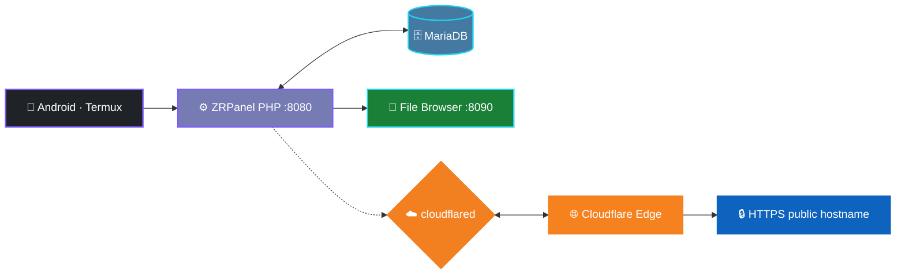
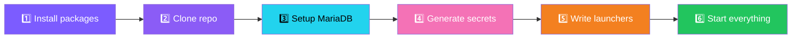

<div align="center">


# ⚡ ZRPanel

### **A full cPanel + WHM–style hosting control panel that runs on your Android phone.**

Everything installs in one command — MariaDB, the PHP panel, the File Browser
file manager and a Cloudflare tunnel for a public HTTPS URL.

<br/>

[](https://php.net)
[](https://mariadb.org)
[](https://termux.dev)
[](https://www.cloudflare.com/products/tunnel/)
[](https://raw.githubusercontent.com/zarifsikder/zenpanel/main/install.sh)

<br/>

```
Requires: Android 8+ · Free · No cloud server · No monthly fees
```

</div>

---

<div align="center">

## 🚀 Quick Install

</div>

Open **Termux** and paste:

```bash
curl -fsSL https://raw.githubusercontent.com/zarifsikder/zenpanel/main/install.sh | bash
```

> **It installs the runtimes, clones the panel, creates the `panel` database with
> all tables, seeds your WHM admin account, installs the file manager and starts
> everything.**

> [!TIP]
> Done? Open **http://localhost:8080/whm** and log in with the admin credentials
> the installer prints at the end.

---

<div align="center">

## 🔄 Update

</div>

Keep the panel on the latest version from anywhere:

```bash
curl -fsSL https://raw.githubusercontent.com/zarifsikder/zenpanel/main/update.sh | bash
```

<details>
<summary>Already installed? Just run the updater on-device instead.</summary>

```bash
~/storage/downloads/hosting/update.sh
```

</details>

> The updater pulls the latest code, syncs the database schema, re-removes the
> installer-only files (`install.sh`, `README.md`) and restarts things if they
> were stopped. Your `config.local.php`, `tunnel_data/` and `user_data/` are
> never touched.

---

<div align="center">

## 🏗️ Architecture



</div>

---

<div align="center">

## 📖 Table of Contents

</div>

| | Section | | Section |
|:---:|:---|:---:|:---|
| 🚀 | [Quick install](#-quick-install) | 🧩 | [Repository layout](#-repository-layout) |
| 🏗️ | [Architecture](#️-architecture) | 🔒 | [Security notes](#-security-notes) |
| ✨ | [Features](#-features) | 🌐 | [Cloudflare setup](#-cloudflare-setup) |
| 🧰 | [Requirements](#-requirements) | 🔑 | [Env vars](#-env-vars) |
| 📦 | [Install](#-install) | ▶️ | [Start / stop](#️-start--stop) |

---

<div align="center">

## ✨ Features

</div>

<table>
<tr>
  <th align="center" width="33%">👤 &nbsp; Client Panel</th>
  <th align="center" width="33%">🛠️ &nbsp; Admin Panel</th>
  <th align="center" width="33%">🔌 &nbsp; Extras</th>
</tr>
<tr>
<td valign="top">

- 🌐 Domains, subdomains, addon domains
- 🧭 DNS manager + track DNS
- 🔐 SSL/TLS & custom certificates
- 💾 Backups & restore, FTP, cron
- 🐘 PHP version + `php.ini` editor
- 🚫 IP blocker, ModSecurity, malware
- 🛡️ Directory protection, error pages
- 🔑 2FA, password security, bandwidth
- ⚛️ WP Toolkit · Node.js · Python apps

</td>
<td valign="top">

- 👥 Accounts, packages, suspend
- 📊 Server health & resource monitor
- 🖥️ System editor
- 🌩️ **Server tunnel manager** — change
  the Cloudflare token & tunnel domain live
- 🎛️ Per-customer tunnel control
- 🔑 API keys
- 🔄 Reset admin password anytime

</td>
<td valign="top">

- 🚀 **Web Apps** — deploy AI-generated
  React/TS projects (ZIP, git, or dir)
- 📁 **File Manager** — `/file-manager`,
  KODExplorer, behind panel login
- 🌐 **Cloudflare DNS** — records, proxied
  CNAME to tunnel, TLS
- 🔌 **Public REST API** `/api/v1` with keys
- 🎚️ **/features** runtime switches
- 💻 Secret terminal · maintenance mode

</td>
</tr>
</table>

---

<div align="center">

## 🧰 Requirements

</div>

<table>
<tr>
<td width="60" align="center">📱</td>
<td>

**Android 8+** with [Termux](https://f-droid.org/packages/com.termux/) and the
`termux-setup-storage` permission (shares `~/storage/downloads`).

</td>
</tr>
<tr>
<td align="center">☁️</td>
<td>

A **Cloudflare account** — only needed for the public tunnel / DNS.

</td>
</tr>
</table>

---

<div align="center">

## 📦 Install

</div>

The one-liner above runs `install.sh`, which:



1. `pkg install`s **PHP, MariaDB, cloudflared**, git & helpers; downloads the
   official **File Browser** binary for your CPU.
2. Clones the repository into `~/storage/downloads/hosting`.
3. Starts **MariaDB**, creates the **`panel`** database and builds the schema —
   all tables **and** the **WHM admin account** in one shot.
4. Generates per-install secrets into the git-ignored `config.local.php`
   (Cloudflare token/zone/tunnel, `/features` admin password, shell key).
5. Writes the **`~/start`** / **`~/off`** launchers and starts everything.

> [!NOTE]
> You may be asked to paste your **Cloudflare tunnel token** — press Enter to
> skip, then add it later from **WHM → Cloudflare Tunnels** or the CLI below.

---

<div align="center">

## ▶️ Start / Stop

</div>

```bash
~/start    # start MariaDB + panel + File Browser + tunnel (idempotent)
~/off      # stop everything the launcher started
```

### 🌍 Access Points

| Access | URL | Status |
|:---|:---|:---:|
| 🖥️ Locally | `http://localhost:8080` |  |
| 🔐 WHM admin | `http://localhost:8080/whm` |  |
| 🌐 Publicly | your Cloudflare hostname |  |

### 🔑 First Login

1. Open **http://localhost:8080/whm** — the installer already created your
   **admin account** and printed the credentials at the end.
2. Reset it anytime: **WHM → Accounts → Reset Password**.
3. Create your first customer account, package and domain.
4. Point the customer's DNS at the tunnel CNAME or the server IP.

> [!TIP]
> Set your own admin credentials at install time with `ZENPANEL_ADMIN_USER` /
> `ZENPANEL_ADMIN_PASS`.

---

<div align="center">

## 🌐 Cloudflare Setup

</div>

Provide these when installing (or later via **WHM → Cloudflare Tunnels →
Server Tunnel**):

| 🔑 Value | 📖 How to get it |
|:---|:---|
| `CF_API_TOKEN` | Cloudflare dashboard → My Profile → API Tokens (Zone: DNS:Edit) |
| `CF_ZONE_ID` | Cloudflare dashboard → your domain → Overview |
| `CF_TUNNEL_ID` | `cloudflared tunnel list` |
| Tunnel connector token | `cloudflared tunnel token <name>` → save to `tunnel_data/panel/connector.token` |
| `SITE_DOMAIN` | public hostname the panel answers on (e.g. `panel.example.com`) |

> [!TIP]
> The **token** and **tunnel domain** can be changed from **WHM → Cloudflare
> Tunnels → Server Tunnel** at any time — it restarts cloudflared with the new
> credentials and stores the domain in the database **and** `config.local.php`.

Have a token already? Skip the install prompt and wire it in now:

```bash
echo -n "$YOUR_TUNNEL_TOKEN" > ~/storage/downloads/hosting/tunnel_data/panel/connector.token
~/start
```

---

<div align="center">

## 🔑 Environment Variables

</div>

All optional — sensible defaults / prompts otherwise:

| ⚙️ Env var | 📝 Purpose |
|:---|:---|
| `ZENPANEL_REPO_URL` | git URL to clone (defaults to this repo) |
| `ZENPANEL_CF_TOKEN` | Cloudflare API token |
| `ZENPANEL_CF_ZONE` | Cloudflare zone id |
| `ZENPANEL_CF_TUNNEL_ID` | Cloudflare tunnel id |
| `ZENPANEL_CF_TUNNEL_TOKEN` | Cloudflare tunnel connector token |
| `ZENPANEL_SERVER_IP` | public IP advertised in DNS records |
| `ZENPANEL_SITE_DOMAIN` | panel tunnel domain (e.g. `panel.example.com`) |
| `ZENPANEL_ADMIN_USER` | WHM admin username (default `admin`) |
| `ZENPANEL_ADMIN_PASS` | WHM admin password (default: generated & printed) |
| `ZENPANEL_PORT` | panel HTTP port (default `8080`) |
| `ZENPANEL_SKIP_FILEBROWSER=1` | skip the File Browser download |
| `ZENPANEL_NO_START=1` | install but don't auto-start |

**Non-interactive install with everything:**

```bash
curl -fsSL https://raw.githubusercontent.com/zarifsikder/zenpanel/main/install.sh \
  | ZENPANEL_REPO_URL=https://github.com/zarifsikder/zenpanel.git \
    ZENPANEL_CF_TOKEN=cfat_... \
    ZENPANEL_CF_ZONE=... \
    ZENPANEL_CF_TUNNEL_ID=... \
    ZENPANEL_CF_TUNNEL_TOKEN=... \
    bash
```

---

<div align="center">

## 🧩 Repository Layout

</div>

```
📦 zenpanel/
├── 🔀 router.php            front controller (routing, compression, minification)
├── ⚙️ config.php            PDO, feature flags, per-install secrets loader
├── 📥 install.sh            the installer (target of the curl one-liner)
├── 🔄 update.sh             the updater (target of the curl update one-liner)
├── 🚀 scripts/start         canonical launcher (wired to ~/start by the installer)
├── 👤 cpanel/               customer control panel
├── 🛠️ whm/                  admin panel
├── 🔌 api/v1/               public REST API
├── 🚀 webapps.php           AI-project deployer + proxy
├── 📁 file-manager/         KODExplorer file manager (served at /file-manager)
├── 🎚️ feature_flags.php     runtime feature switches (/features)
├── 🎨 assets/               CSS/JS/theme
└── 📚 docs/                 setup guides
```

---

<div align="center">

## 🔒 Security Notes

</div>

> [!WARNING]
> **Do NOT expose this on an unauthenticated public network** — it is a full
> control panel with shell access.

- 🔐 `config.local.php`, `tunnel_data/`, `user_data/`, `*.pem` and database
  files are **git-ignored** — per-install secrets never reach the repository.
- 🔄 The installer rotates the `/features` password and the secret shell key on
  every install (and prints the one-time `/features` password at the end).
- 🛡️ Always enable **2FA** on your admin account after first login.

---

<div align="center">


### **⭐ Star this repo if ZRPanel helped you!**

[](#-quick-install)
[](https://github.com/zarifsikder/zenpanel/issues)

</div>
